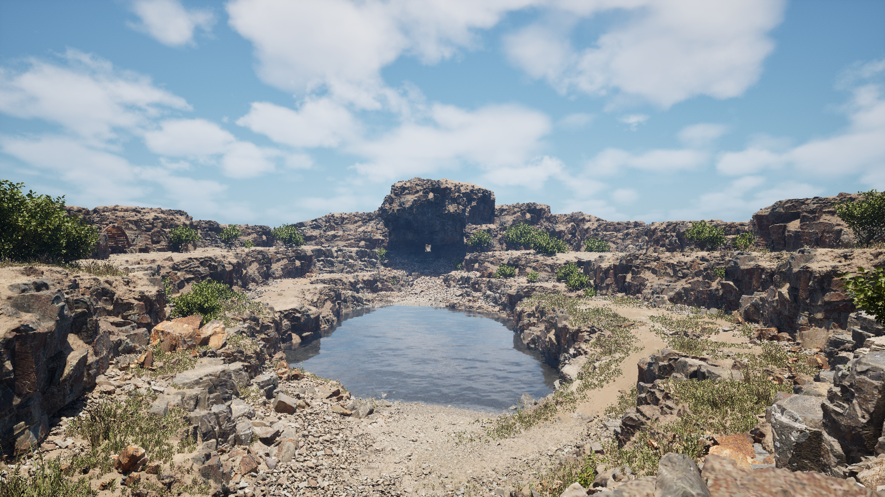
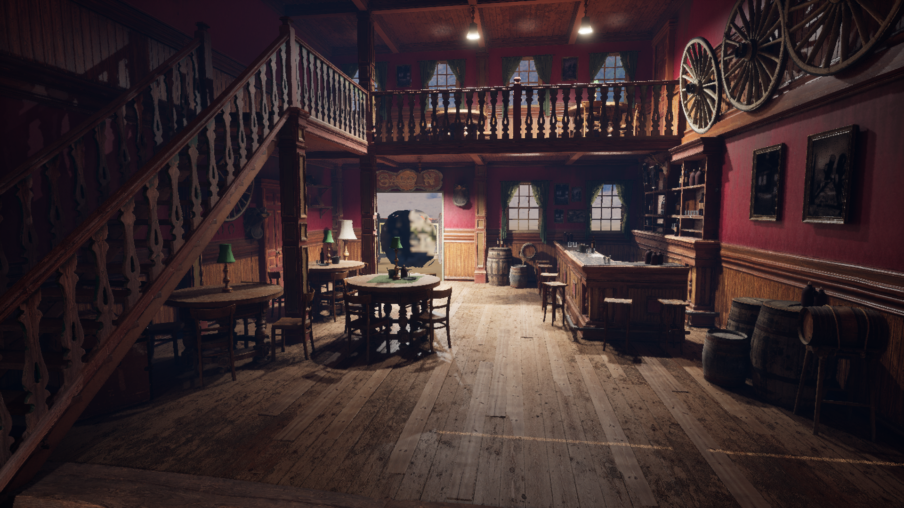
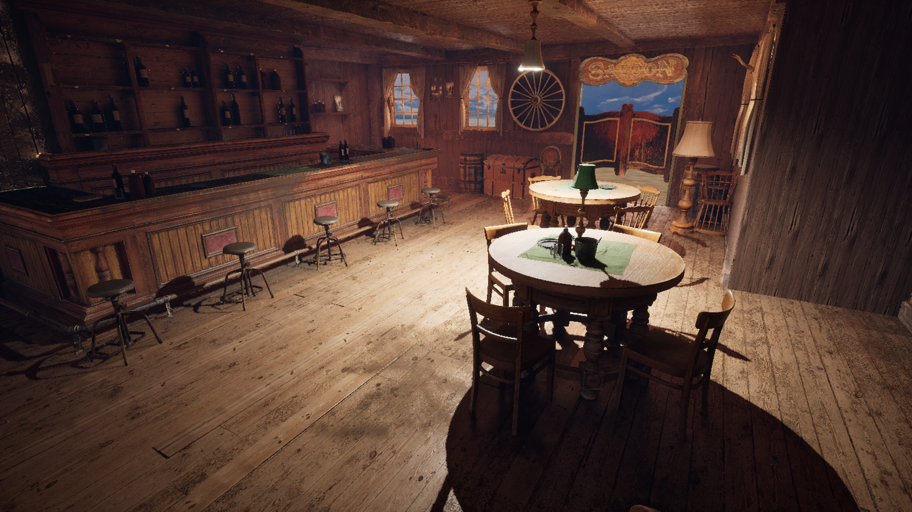
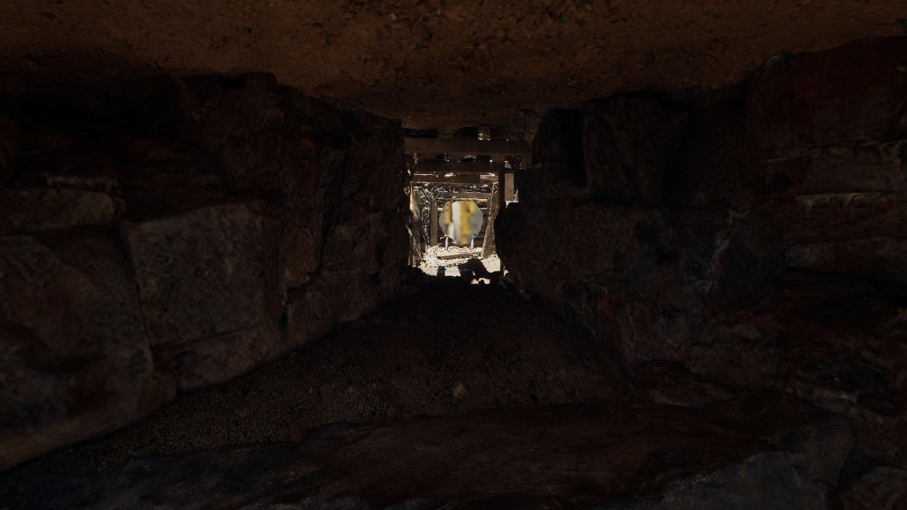
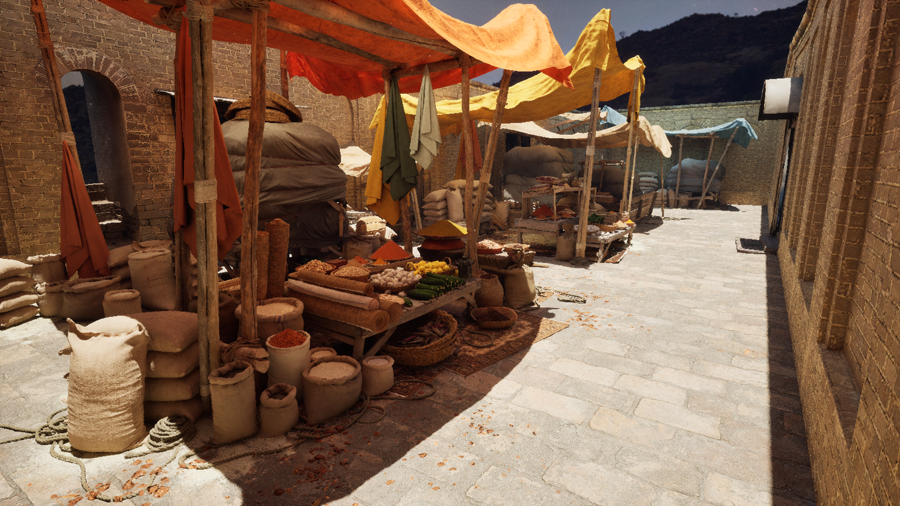
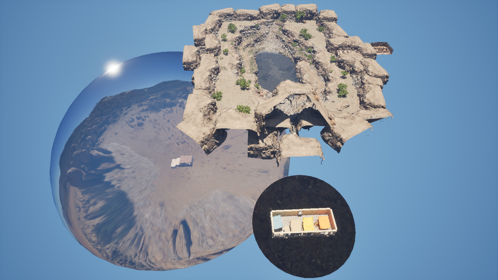

# 
🧊 Geppetto 🎮

    <a href="https://www.youtube.com/watch?v=C7l-3EdgJ_M">
    

## 🔍 About

Geppetto is a 5th year [Epitech](https://github.com/NairodGH/Epitech) project.\
The goal was to create a broad “VR experience,” which gave me creative freedom and led me to start the project in [Unreal Engine](https://www.unrealengine.com/en-US), shortly after the 5.0 release.\
At the same time, [Quixel](https://quixel.com/megascans) had released Megascans assets, free to claim until the end of the year.

The quality of the prebuilt environments inspired the idea of a time-traveling lobby, allowing users to explore high-quality scenes through portals.\
Some scenes use skyboxes from [Polyhaven](https://polyhaven.com/hdris/skies).\
The portals are from [SERLO](https://www.fab.com/listings/09c25974-9702-42f0-8265-67cf982824b7), and the VR-FPS controls tutorial is from [Metaxis Games](https://www.youtube.com/watch?v=k-nlcAYXMW0).

All environment integration, portal setup, performance optimization, and development workflow improvements were done by hand.\
Unfortunately, when the project started, the teacher made it significantly easier for my team to work on Unity instead.\
I did not want the time spent on this project to go to waste, so I continued working on it independently.\
The final Unity project is listed on my [itch.io](https://nairodio.itch.io/tochidanjon).  

The full project would have been hosted on [Diversion](https://www.diversion.dev/) since its assets exceed GitHub repository limits, but Diversion does not currently support public repositories.\
As a result, this repository contains as many meaningful non-binary project files as possible, along with a showcase [video](https://www.youtube.com/watch?v=C7l-3EdgJ_M).

## 📸 Screenshots

